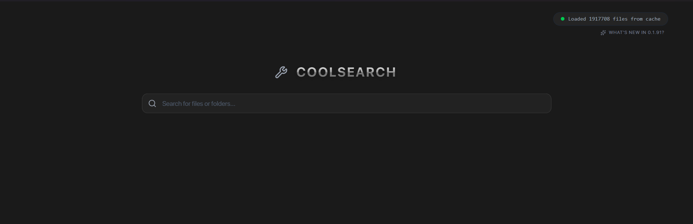

# coolSearch



A high-performance, instantaneous file search utility for Windows built with Tauri, Rust, and React.

## Description

**coolSearch** is designed for extreme speed. While traditional search tools crawl your folders one by one, coolSearch talks directly to your hard drive's "internal map" (the Master File Table) to find every single file on your computer in less than a second. It combines the raw power of Rust with a sleek, modern React interface to make finding files feel instant.

## How It Works (From the Ground Up)

To achieve near-instantaneous indexing of an entire hard drive, coolSearch bypasses standard file system APIs and interacts directly with the low-level storage structures of Windows.

### 1. Privilege Elevation & Volume Access
Accessing the raw data of a hard drive is a sensitive operation. coolSearch is configured with a custom Windows Manifest that requests **Administrator privileges** on startup. This elevation allows the Rust backend to open a raw handle to the physical volume (like `\\.\C:`) using the Windows `CreateFileW` API.

Example of the volume open step:

```rust
let handle = CreateFileW(
  L"\\.\C:",
  GENERIC_READ,
  FILE_SHARE_READ | FILE_SHARE_WRITE,
  std::ptr::null_mut(),
  OPEN_EXISTING,
  FILE_ATTRIBUTE_NORMAL,
  std::ptr::null_mut(),
);
```

### 2. MFT Enumeration via USN Journal
The secret to the app's speed is the **Master File Table (MFT)**. The MFT is a hidden NTFS system file that tracks every file and folder on a volume.

Instead of walking the directory tree one folder at a time, coolSearch uses `DeviceIoControl` with the `FSCTL_ENUM_USN_DATA` control code. This tells Windows to stream raw USN journal records directly into memory.

```rust
DeviceIoControl(
  handle,
  FSCTL_ENUM_USN_DATA,
  &mft_enum_data,
  std::mem::size_of::<MFT_ENUM_DATA_V0>() as u32,
  buffer.as_mut_ptr() as *mut _,
  buffer.len() as u32,
  &mut bytes_returned,
  std::ptr::null_mut(),
);
```

This is far faster than traditional folder enumeration because it avoids opening every individual directory and instead processes bulk filesystem metadata.

### 3. Tree Path Resolution
Raw MFT data does not store full file paths like `C:\Windows\System32\cmd.exe`. Instead, it stores each entry's name and a **Parent Reference ID**.

coolSearch reconstructs full paths in two passes:

1. **Pass 1 (Ingestion):** build a map of `FileID -> Name` and `FileID -> ParentID`.
2. **Pass 2 (Resolution):** walk parent IDs upward until the root is reached, then join names into a full path.

```rust
let mut path_parts = Vec::new();
let mut current_id = file_id;
while current_id != root_id {
  path_parts.push(name_map[&current_id].clone());
  current_id = parent_map[&current_id];
}
path_parts.reverse();
let full_path = path_parts.join("\\");
```

### 4. Fluid Frontend & IPC
The frontend is a modern **React** application that communicates with the Rust engine through **Tauri**.

- **Virtualized Rendering:** Results use a virtualized list so only visible rows are rendered, making the UI fast even for millions of matches.
- **Tauri IPC:** Search queries are dispatched with `invoke("search_files", { query })`, and the Rust backend returns results asynchronously.

```ts
const results = await invoke<FileRecord[]>("search_files", { query });
```

This design keeps the UI responsive while the backend performs the heavy lifting.

## Security & Hardening

Given its high-privilege nature, coolSearch implements several layers of security to ensure system integrity:

- **Memory-Safe MFT Parsing:** The Rust backend implements strict boundary validation for all USN journal records, preventing buffer overflows or out-of-bounds reads from malformed filesystem data.
- **Path Sanitization:** All filesystem actions (Metadata, Copy Path, Open Explorer) are protected by a validation layer that enforces absolute path usage and prevents directory traversal attacks (`..`).
- **Content Security Policy (CSP):** The frontend is restricted by a strict CSP, allowing the `asset:` protocol only for local image rendering while blocking unauthorized external resources.

